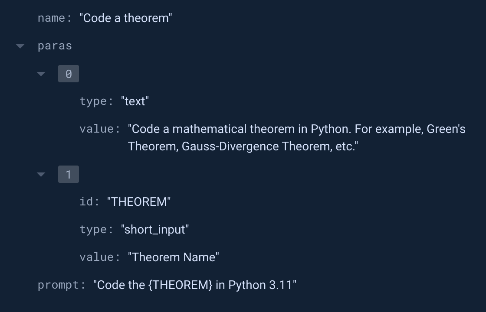

# OpenAI To-Do

An iOS app made using SwiftUI, Firebase and OpenAI API. It achieves level 4 of the SRM Swift Coding Club, Technical Recruitment 2024. 

The app provides users a list of 5 interesting and interactive tasks to complete using the OpenAI API and provides them with a sharable certificate at the end. The certificate is generated automatically using a Flask API based on [tusharnankani/CertificateGenerator](https://github.com/tusharnankani/CertificateGenerator), which I developed and deployed on an EC2 instance.

I have closely followed the technical requirements, as my skills are best oriented for that. I look forward to the club's creative heads to supply ideas I can bring to life through code. 

https://github.com/adikul358/openai-todo/assets/38763258/afbcace6-a51c-4c6b-b88e-924a87217e60

## Task Generation

The tasks are stored in a Firebase Cloudstore collection in the format similar to JSONified markdown.

```JS
{
    name: // Task name
    paras: [ // List of various paragraphs required for the task 
        {
            id: // Used for string interpolation with user input in input fields
            type: // UI element types such as text, short_input, code_input
            value: // Values that can be used either as text display or input placeholder display
        }
        ...
    ]
    query: // query with variables present as {INPUT_ID} that are interpolated
}
```

An example of a current task:



The flexible NoSQL based data storage is ideal for this data structure.


## OpenAI API

The app replaces the user input as per the string from Firebase and sends the query to the OpenAI API. The response is then displayed, and the latest response is saved on-device for future reference.

As SwiftUI renders markdown built-in, API responses are very _swiftly_ rendered.

> **P.S.*: I didn't know anything about Swift before this, and decided to make this a one-all-nighter project.
